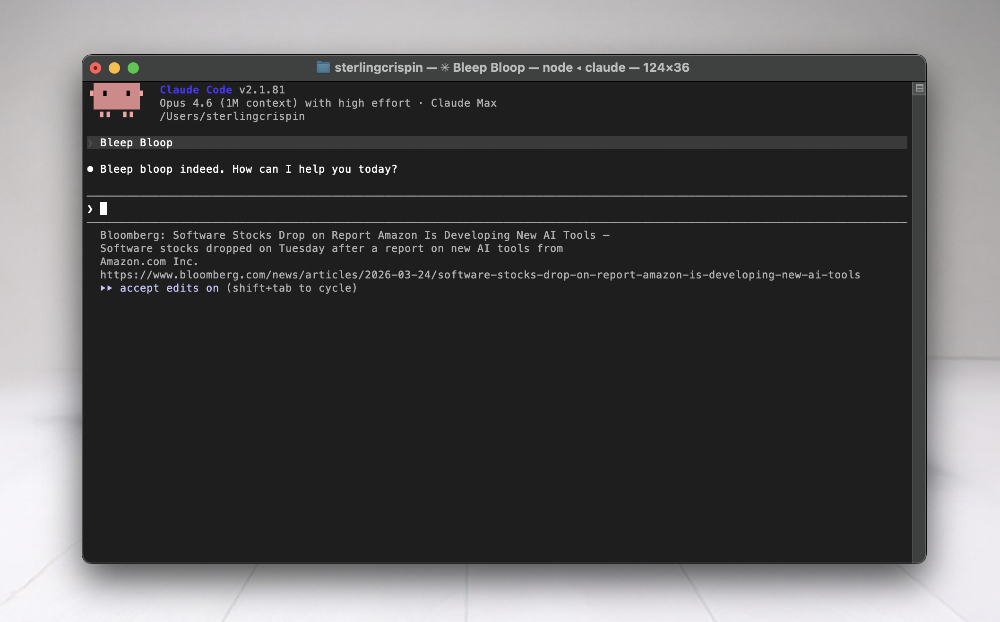

# Claude Code News Headlines

News headlines in your Claude Code status line. Every time you send a message, a new headline appears from one of 14 sources — no API keys, no paid services.


## Install

```bash
curl -fsSL https://raw.githubusercontent.com/sterlingcrispin/claudenews/main/install.sh | bash
```

Then restart Claude Code.



## What it does

- **On every message you send**: A background hook fetches headlines from a random news source and queues the next headline
- **In your status line**: The current headline is displayed with its description, word-wrapped to your terminal width
- **No repeats**: Headlines cycle through a shuffled queue so you see every story before any repeat

Example output:
```
BBC News: First-time buyers hit as mortgage rates keep rising — More than 200
  first-time buyer deals have disappeared from the market since 6 March.
  https://www.bbc.com/news/articles/c5y7gnkez3lo
```

## Sources

Headlines are fetched via RSS using `curl` + Python's built-in XML parser. No API keys or third-party services required.

| Source | Feed |
|---|---|
| BBC News | feeds.bbci.co.uk |
| NPR | feeds.npr.org |
| Al Jazeera | aljazeera.com |
| The Guardian | theguardian.com |
| NBC News | feeds.nbcnews.com |
| CBS News | cbsnews.com |
| NYT | rss.nytimes.com |
| PBS NewsHour | pbs.org |
| Fox News | foxnews.com |
| Politico | politico.com |
| Bloomberg | bloomberg.com |
| TechCrunch | techcrunch.com |
| Ars Technica | arstechnica.com |
| Hacker News | Firebase API |

## Requirements

- macOS or Linux
- `curl`
- `python3` (standard library only, no pip packages)
- Claude Code

## Customizing Sources

The feed list lives in `~/.claude/news/fetch_headlines.sh` — it's just a bash array called `FEEDS`. You can edit it directly, or ask Claude to do it:

> "Open ~/.claude/news/fetch_headlines.sh and remove Fox News and Bloomberg from the FEEDS list"

> "Add the NASA RSS feed to ~/.claude/news/fetch_headlines.sh"

Any RSS feed works. The format is `"Name|https://example.com/feed.xml"`.

After editing, run `rm ~/.claude/news_cache/queue.tsv` to reset the headline queue.

## Uninstall

```bash
curl -fsSL https://raw.githubusercontent.com/sterlingcrispin/claudenews/main/uninstall.sh | bash
```

## How it works

Three scripts in `~/.claude/news/`:

- **`fetch_headlines.sh`** — Runs as a `UserPromptSubmit` hook. Picks a random RSS source, fetches headlines, manages a shuffle queue, and promotes the next headline for display.
- **`parse_rss.py`** — Parses RSS/Atom XML and extracts title, description (first sentence), and link as TSV.
- **`news_statusline.sh`** — Reads the current headline and word-wraps it to your terminal width for the status line.

Cache lives in `~/.claude/news_cache/`.
